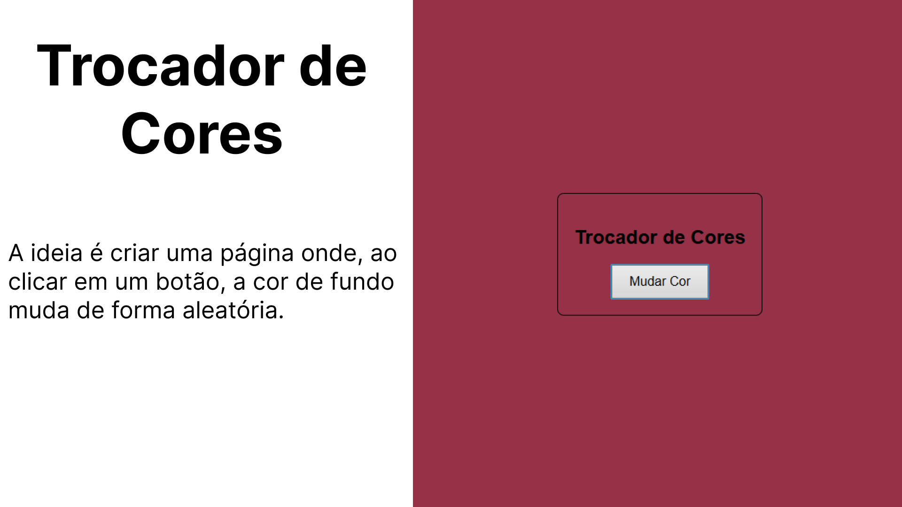

# 🎨 Trocador de Cores – Projeto Simples e Interativo  

🖼️ **Imagens do Projeto**  
  
---

Esse é um projeto bem simples, mas divertido, que desenvolvi para treinar conceitos básicos de **HTML, CSS e JavaScript**.  

A ideia é criar uma página onde, ao clicar em um botão, a cor de fundo muda de forma **aleatória**.  
O funcionamento é bem direto:  
- Estrutura básica em **HTML** para organizar a página.  
- Estilização em **CSS** para centralizar os elementos e deixar a interface agradável.  
- Um pequeno script em **JavaScript** que gera cores aleatórias em hexadecimal e aplica no `background` do site.  

Esse tipo de projeto é ótimo para reforçar conceitos como manipulação do **DOM**, geração de valores aleatórios e interação com eventos de clique. 🚀  

Pequenos exercícios assim são importantes para evoluir na prática da programação, e servem também como base para ideias maiores, como paletas de cores automáticas, temas customizáveis e até geradores visuais.  

🔗 [Acesse o código no GitHub](https://github.com/thamiressarges/trocador_de_cores)  
🌐 [Veja funcionando no GitHub Pages](https://thamiressarges.github.io/trocador_de_cores)  
